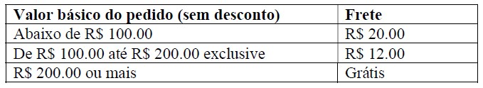
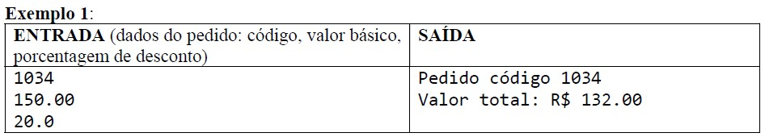
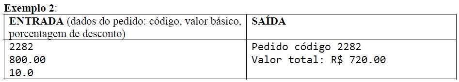
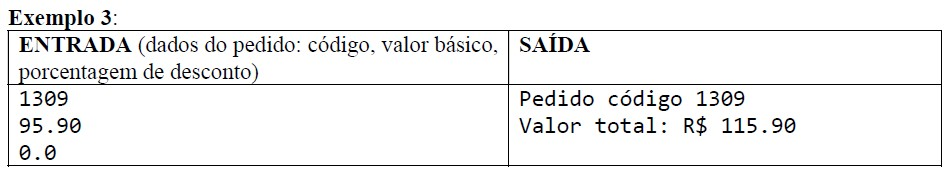
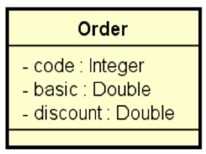

# Projeto Desafio Aula1

## DESAFIO: Componentes e injeção de dependência

Criar um sistema para calcular o **valor total** de um pedido, considerando uma porcentagem de desconto e o frete. O cálculo do **valor total** do pedido consiste em aplicar o desconto ao **valor básico** do pedido, e adicionar o valor do frete. A regra para cálculo do frete é a seguinte:










A solução deverá seguir as seguintes especificações:

Um pedido deve ser representado por um objeto conforme projeto abaixo:<br/>


A lógica do cálculo do valor total do pedido deve ser implementada por componentes (serviços), cada um com sua responsabilidade, conforme projeto abaixo:<br/>


Serviço OrderService: responsável por operações referentes a pedidos.<br/>
Serviço ShippingService: responsável por operações referentes a frete.<br/>

Sua solução deverá ser implementada em Java com Spring Boot. A saída deverá ser mostrada no log do terminal da aplicação. Cada serviço deve ser implementado como um componente registrado com @Service.

## Temas abordados - 2º Dia

### Relacionamentos


---

### Resumo - 2º Dia

* Relacionamentos N-N
* Classe de associação, embedded id
* Consultas SQL no Spring Data JPA
* Projections


## Temas abordados - 3º Dia

### Perfis de projeto

#### 1. Perfil de desenvolvimento e testes:
  **test**<br/>
  Banco de dados H2

#### 2. Perfil de homologação / staging:**
  **dev**<br/>
  Banco de dados Postgres de homologação

#### 3. Perfil de produção:**
  **prod**<br/>
  Banco de dados Postgres de produção

---
  
### Passos homologação

#### Preparação do ambiente
Docker ou Postgresql + pgAdmin ou DBeaver

#### Homologação local

1. Criar perfis de projeto<br/>
/* system.properties
2. Gerar script da base de dados<br/>
/* apagar arquivo gerado
3. Criar base de dados de homologação
4. Rodar app no modo dev e validar

---

### Passos deploy CI/CD

#### Pré-requisitos
- Conta no Railway
- Conta no Github com mais de 90 dias
- Projeto Spring Boot salvo no seu Github
- Script SQL para criação e seed da base de dados
- Aplicativo de gestão de banco instalado (pgAdmin ou DBeaver)

#### Passos Railway
1. Prover um servidor de banco de dados
2. Criar a base de dados e seed
3. Criar uma aplicação Railway vinculada a um repositório Github
4. Configurar variáveis de ambiente

```
APP_PROFILE
DB_URL (Formato: jdbc:postgresql://host:porta/nomedabase)
DB_USERNAME
DB_PASSWORD
CORS_ORIGINS
```

5. Configurar o domínio público para a aplicação
6. Testar app no Postman
7. Testar a esteira de CI/CD

---

### Resumo - 3º Dia

* Perfis de projeto
* Ambiente local com Docker Compose
* Processo de homologação local
* Processo de deploy com CI/CD
* Configuração de CORS


## Tema abordado - 4º Dia

### Endpoint especial


---

### Resumo - 4º Dia

* Design e implementação de endpoint especial
* Operação de atualização no Spring
* Operações com List
* Verbo HTTP e idempotência

