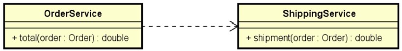

# Projeto Desafio Aula1

## DESAFIO: Componentes e injeção de dependência

Criar um sistema para calcular o **valor total** de um pedido, considerando uma porcentagem de desconto e o frete. O cálculo do **valor total** do pedido consiste em aplicar o desconto ao **valor básico** do pedido, e adicionar o valor do frete. A regra para cálculo do frete é a seguinte:

A solução deverá seguir as seguintes especificações:

Um pedido deve ser representado por um objeto conforme projeto abaixo: 

A lógica do cálculo do valor total do pedido deve ser implementada por componentes (serviços), cada um com sua responsabilidade, conforme projeto abaixo: 

Serviço OrderService: responsável por operações referentes a pedidos. 
Serviço ShippingService: responsável por operações referentes a frete. 

Sua solução deverá ser implementada em Java com Spring Boot. A saída deverá ser mostrada no log do terminal da aplicação. Cada serviço deve ser implementado como um componente registrado com @Service.
